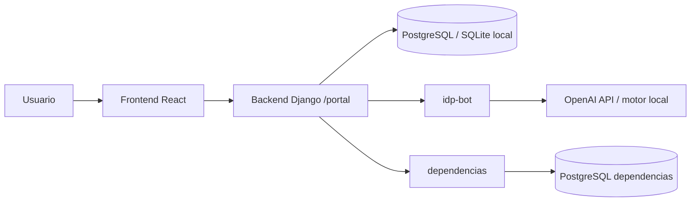

# Instituto Tecnológico Nacional de Acapulco

### **Equipo:** EVA 06

---

# 🚀 ALEBRIJE GUÍA
> **Sistema inteligente de ventanilla única y autenticación documental para gobiernos locales**

---

### 📋 Información del Reto

* **Reto:** Tecnologías para la Gestión Pública
* **Temática:** Automatización Digital de Procesos
* **Asesor:** Mtro. Iván Hernández Caballero

---

### 👥 Integrantes

* **Moreno de Jesús Iris Lizbeth** — *Ingeniería en Gestión Empresarial (IGE)*
* **Ahuixtle Matador Zitlali** — *Licenciatura en Administración (ADMIN)*
* **José María Ramírez Arévalo** — *Ingeniería en Sistemas Computacionales (ISC)*
* **Eduardo Rivera Ávila** — *Ingeniería en Sistemas Computacionales (ISC)*
* **Cuauhtémoc Mojica Gutiérrez** — *Ingeniería en Sistemas Computacionales (ISC)*
</div>

---

# Manual técnico del proyecto Hackatec Regional

## 1. Introducción

Este repositorio contiene una solución multi-servicio para gestión de trámites ciudadanos, análisis documental, integración con dependencias y procesamiento de identificación mediante un bot de IA. El proyecto está dividido en cuatro módulos principales:

- `backend/`: portal ciudadano en Django.
- `frontend/`: interfaz web del ciudadano construida con React + Vite.
- `dependencias/`: portal de revisión de dependencias, también en Django.
- `idp-bot/`: servicio de clasificación/análisis documental con OpenAI o motor local.

El sistema permite:

- registro, login y verificación de usuarios;
- carga y almacenamiento de documentos;
- análisis automatizado de documentos mediante un bot IDP;
- registro y seguimiento de solicitudes/trámites;
- envío de expedientes a dependencias externas;
- resolución simulada de expedientes por áreas.

---

## 2. Objetivo del sistema

El proyecto busca ofrecer un flujo digital para ciudadanos que necesiten presentar documentación y completar procedimientos administrativos. La solución combina:

1. autenticación y gestión de usuarios,
2. almacenamiento seguro de documentos,
3. validación automática de tipos de documentos,
4. trazabilidad de solicitudes,
5. integración con dependencias y revisión por áreas.

La implementación está orientada a una demostración funcional y a despliegues en Render/Vercel, con enfoque en simplicidad operativa y separación por servicios.

---

## 3. Arquitectura general



### 3.1 Módulos

#### Backend ciudadano (`backend/`)
- Framework: Django 5.2
- Funcionalidad: autenticación, catálogo de procedimientos, gestión de documentos, análisis documental, tramitación, integración con dependencias.
- Base de datos: PostgreSQL en producción, SQLite para desarrollo local.
- Almacenamiento de archivos: almacenamiento privado compatible con S3/Supabase Storage.

#### Frontend (`frontend/`)
- Framework: React + Vite
- Funcionalidad: interfaz del ciudadano para iniciar sesión, subir documentos, seguir trámites y ver el estado de solicitudes.
- Comunicación: API REST bajo `/api/` con cookies de sesión y CSRF.

#### Dependencias (`dependencias/`)
- Framework: Django
- Funcionalidad: portal de revisores por área (Protección Civil, Obras Públicas, Ecología).
- Uso: recepción de expedientes, revisión, resolución y seguimiento del estado.

#### Bot IDP (`idp-bot/`)
- Servicio independiente que analiza documentos y devuelve resultados estructurados.
- Soporta OpenAI Responses API y un proveedor local.
- Se comunica con Django mediante una API interna.

---

## 4. Estructura del repositorio

```text
hackatec-regional/
├── backend/
│   ├── config/
│   │   ├── __init__.py
│   │   ├── settings.py
│   │   ├── urls.py
│   │   ├── wsgi.py
│   │   └── asgi.py (si existe)
│   ├── portal/
│   │   ├── models.py
│   │   ├── views.py
│   │   ├── urls.py
│   │   ├── catalog.py
│   │   ├── dependencies.py
│   │   ├── idp.py
│   │   ├── migrations/
│   │   └── tests/
│   ├── manage.py
│   ├── requirements.txt
│   ├── Dockerfile
│   ├── DEPLOYMENT.md
│   └── render.yaml
├── frontend/
│   ├── src/
│   ├── public/
│   ├── package.json
│   ├── vite.config.js
│   ├── vercel.json
│   ├── DEPLOYMENT.md
│   └── index.html
├── dependencias/
│   ├── config/
│   ├── receiver/
│   ├── manage.py
│   ├── requirements.txt
│   ├── README.md
│   ├── Dockerfile
│   └── render.yaml
├── idp-bot/
│   ├── main.py
│   ├── processor.py
│   ├── openai_processor.py
│   ├── tests/
│   ├── requirements.txt
│   ├── README.md
│   ├── docker-compose.yml
│   ├── Dockerfile
│   └── .env.example
├── render.yaml
├── MANUAL_TECNICO.md
└── .gitignore
```

---

## 5. Modelo de negocio

### 5.1 Backend ciudadano

El modelo principal del portal ciudadano incluye:

- `User`: usuario autenticado con email único, CURP y nivel de verificación.
- `Verification`: código de verificación para cuenta y validación de email.
- `Application`: solicitud o trámite, con propietario, procedimiento, estado y folio.
- `Document`: documento asociado a un usuario o solicitud, con contenido, tipo, archivo persistente y análisis.
- `Attachment`: relación entre aplicación y documentos cargados.
- `Delivery`: registro del envío de la solicitud a dependencias externas.

El flujo típico es:

1. registro del usuario;
2. verificación de correo;
3. carga de documentos;
4. análisis automático del documento;
5. asociación a una solicitud;
6. envío a dependencias;
7. consulta del estado por parte del ciudadano.

### 5.2 Dependencias

La aplicación de dependencias gestiona expediente, documentos y resolución por área. Cada área puede revisar sus documentos y completar una resolución. El ciudadano consulta luego el estado final.

---

## 6. Endpoints principales

### 6.1 Backend ciudadano

Rutas definidas en `backend/portal/urls.py`:

- `GET /api/health/`
- `GET /api/auth/session/`
- `POST /api/auth/register/`
- `POST /api/auth/verify/`
- `POST /api/auth/resend/`
- `POST /api/auth/login/`
- `POST /api/auth/logout/`
- `GET /api/catalog/`
- `GET /api/documents/`
- `GET /api/documents/<uuid:doc_id>/`
- `GET /api/documents/<uuid:doc_id>/download/`
- `POST /api/documents/<uuid:doc_id>/analyze/`
- `GET /api/applications/`
- `GET /api/applications/<uuid:app_id>/`
- `POST /api/applications/<uuid:app_id>/submit/`
- `POST /api/applications/<uuid:app_id>/dependencies/`

Estas rutas permiten la gestión completa del flujo ciudadano.

### 6.2 Frontend

El frontend usa una API client centralizada en `frontend/src/api.js` que:

- llama a `/api/...` en el mismo origen;
- envía cookies de sesión;
- incluye `X-CSRFToken` para peticiones con método que no sean GET;
- maneja errores con mensajes amigables al usuario.

### 6.3 Dependencias

El servicio de dependencias expone endpoints para:

- registrar expediente;
- enviar archivos;
- confirmar recepción;
- consultar estados por área;
- resolver solicitudes con aprobación/rechazo.

---

## 7. Seguridad y autenticación

### 7.1 Backend ciudadano

La configuración principal en `backend/config/settings.py` incluye:

- `SECRET_KEY` obligatoria en producción.
- `DEBUG` controlado por variable de entorno.
- `ALLOWED_HOSTS` configurable.
- `AUTH_USER_MODEL = 'portal.User'`.
- validadores de contraseña con mínimo de 10 caracteres en producción.
- cookies de sesión con `HttpOnly` y políticas de SameSite.
- `SECURE_SSL_REDIRECT = not DEBUG`.
- soporte para almacenamiento seguro con Supabase Storage.

### 7.2 Validación de correo

El sistema implementa verificación de cuenta por correo, con códigos temporales y control de intentos. Si `EMAIL_DEMO_MODE=true`, los códigos se muestran por consola en lugar de enviarse realmente por email.

### 7.3 Dependencias

El servicio de dependencias exige la clave de integración `INTEGRATION_KEY` y un `INTEGRATION_SOURCE` definido para validar llamadas entre backends. Las llamadas utilizan cabeceras tipo:

- `X-Integration-Key`
- `X-Source`

Esto evita que una instalación no autorizada pueda emitir o aceptar peticiones.

---

## 8. Configuración de entorno

## 8.1 Backend ciudadano

Variables relevantes:

```dotenv
DJANGO_DEBUG=true|false
DJANGO_SECRET_KEY=...
DJANGO_ALLOWED_HOSTS=localhost,127.0.0.1,testserver
DATABASE_URL=postgresql://...
CSRF_TRUSTED_ORIGINS=http://localhost:5173,http://127.0.0.1:5173
SUPABASE_STORAGE_ENDPOINT=...
SUPABASE_STORAGE_BUCKET=...
SUPABASE_STORAGE_ACCESS_KEY_ID=...
SUPABASE_STORAGE_SECRET_ACCESS_KEY=...
IDP_BOT_URL=https://...
IDP_API_KEY=...
IDP_TIMEOUT=120
EMAIL_BACKEND=...
EMAIL_HOST=...
EMAIL_PORT=587
EMAIL_HOST_USER=...
EMAIL_HOST_PASSWORD=...
EMAIL_USE_TLS=true
DEFAULT_FROM_EMAIL=...
EMAIL_DEMO_MODE=true|false
DOCUMENT_SIMULATION_ENABLED=true|false
DEPENDENCIES_URL=https://...
DEPENDENCIES_KEY=...
DEPENDENCIES_SOURCE=...
```

### Reglas críticas
- Si `DEBUG=false`, el backend exige PostgreSQL.
- Si `DEBUG=false`, exige un bucket y credenciales de S3/Storage válidas.
- Requiere `IDP_API_KEY` robusta en producción.
- Requiere credenciales SMTP o `EMAIL_DEMO_MODE=true`.

## 8.2 Dependencias

```dotenv
DJANGO_DEBUG=false
DJANGO_SECRET_KEY=...
DJANGO_ALLOWED_HOSTS=<dominio-real>.onrender.com
CSRF_TRUSTED_ORIGINS=https://<dominio-real>.onrender.com
DATABASE_URL=<connection string PostgreSQL>
INTEGRATION_KEY=<secreto compartido de 32+ caracteres>
INTEGRATION_SOURCE=portal-render-demo
```

## 8.3 Bot IDP

```dotenv
IDP_ENV=production
IDP_PROVIDER=openai
OPENAI_API_KEY=...
OPENAI_MODEL=gpt-4.1
```

También se puede operar con `IDP_PROVIDER=local` para un motor OCR local.

## 8.4 Frontend

El frontend no almacena secretos ni claves de OpenAI o Supabase. Su configuración está orientada a un reverse proxy (Vercel o desarrollo local) hacia `/api` del backend.

---

## 9. Ejecución local

## 9.1 Backend

Desde la raíz del proyecto:

```powershell
cd backend
python -m venv .venv
.\.venv\Scripts\Activate.ps1
pip install -r requirements.txt
python manage.py migrate
python manage.py runserver 0.0.0.0:8000
```

Configuración recomendada para local:

```powershell
$env:DJANGO_DEBUG='true'
$env:DATABASE_URL=''
$env:DJANGO_ALLOWED_HOSTS='localhost,127.0.0.1,testserver'
```

## 9.2 Frontend

```powershell
cd frontend
npm install
npm run dev
```

El frontend queda en una URL local del tipo:

```text
http://127.0.0.1:5173
```

## 9.3 Dependencias

```powershell
cd dependencias
python -m venv .venv
.\.venv\Scripts\Activate.ps1
pip install -r requirements.txt
python manage.py migrate
python manage.py runserver 0.0.0.0:8001
```

## 9.4 Bot IDP

```powershell
cd idp-bot
pip install -r requirements.txt
copy .env.example .env
# editar .env con OPENAI_API_KEY
python main.py
```

O bien, con Docker:

```powershell
docker compose --env-file .\idp-bot\.env -f .\idp-bot\docker-compose.yml up -d --build --wait
```

---

## 10. Despliegue

## 10.1 Backend en Render

Se recomienda usar el archivo `backend/render.yaml` y crear un Web Service Docker. Las variables de entorno deben configurarse de forma segura y no versionarse.

Puntos clave:

- `Runtime`: Docker
- `Dockerfile Path`: `backend/Dockerfile`
- `Root Directory`: raíz del repositorio o `backend` según estrategia
- `Health Check Path`: `/api/health/`
- `Pre-Deploy Command`: `python manage.py migrate --noinput`

## 10.2 Frontend en Vercel

El frontend se despliega como proyecto de Vercel con `frontend` como `Root Directory` y Vite como framework. Una configuración de rewrite permite redirigir `/api/*` al backend Django.

## 10.3 Dependencias en Render

Se crea un servicio Docker independiente usando `dependencias/render.yaml`.

Se deben crear revisores por área con:

```sh
python manage.py create_reviewer proteccion proteccion_civil
python manage.py create_reviewer obras obras_publicas
python manage.py create_reviewer ecologia ecologia
```

---

## 11. Integración entre servicios

### 11.1 Bot IDP

El bot analiza documentos y devuelve una estructura JSON con información del tipo de archivo y datos asociados a la identificación.

Incluye:

- validación de campos mínimos,
- separación de nombre y apellidos,
- chequeo de CURP, fechas y vigencia,
- soporte para documentos como INE, CFE, CURP y otros tipos adicionales.

### 11.2 Envío a dependencias

El backend ciudadano coordina el flujo de envío con el servicio de dependencias. La entrega se registra en `Delivery` y se hace de forma segura con una clave compartida y un orígen configurado.

---

## 12. Pruebas y validación

El proyecto incluye pruebas en Django y en el bot.

### Backend ciudadano

```powershell
cd backend
python manage.py test portal --noinput
```

### Dependencias

```powershell
cd dependencias
python manage.py test receiver --noinput
```

### Bot IDP

```powershell
cd idp-bot
python -m unittest discover -s tests
```

### Frontend

```powershell
cd frontend
npm run build
```

---

## 13. Buenas prácticas y recomendaciones

- No versionar `.env`, secretos, bases SQLite ni documentos reales.
- Usar PostgreSQL en producción.
- Mantener `CSRF_TRUSTED_ORIGINS` estrictamente limitado.
- Usar `EMAIL_DEMO_MODE=true` solo para demos, no para entornos de producción reales.
- Mantener el bot separado del frontend y del backend con credenciales independientes.
- Mantener el origen y la clave de integración del servicio de dependencias sincronizados entre servicios.
- Usar bucket privado para documentos y no exponer URLs públicas.

---

## 14. Riesgos y observaciones de implementación

- El portal ciudadano y la app de dependencias son dos sistemas distintos con bases de datos separadas.
- El flujo de integración es demo-oriented y requiere configuración exacta entre claves y orígenes.
- El análisis documental con OpenAI no sustituye validación legal ni revisión humana.
- Las pruebas automatizadas verifican comportamiento funcional, no exactitud real de clasificación por documentación compleja.
- En producción se requieren variables de entorno correctas y protección de secretos.

---

## 15. Resumen operativo

El proyecto está diseñado como una plataforma modular y desplegable:

- frontend para ciudadanos,
- backend para gestión y lógica de negocio,
- dependencias para revisión institucional,
- bot IA para análisis documental,
- despliegue con Render y Vercel,
- seguridad por variables de entorno, cookies, CSRF y autenticación.

Su fuerte es la separación de responsabilidades y la posibilidad de desplegar cada servicio de forma independiente, mientras se mantiene un flujo unificado para la experiencia del usuario.

---

## 16. Comandos útiles

```powershell
# Backend
cd backend
python manage.py migrate
python manage.py test portal --noinput
python manage.py runserver 0.0.0.0:8000

# Frontend
cd frontend
npm install
npm run dev
npm run build

# Dependencias
cd dependencias
python manage.py migrate
python manage.py test receiver --noinput
python manage.py runserver 0.0.0.0:8001

# Bot IDP
cd idp-bot
python -m unittest discover -s tests
```

---

## 17. Contacto / mantenimiento

Este documento sirve como base de operación y mantenimiento técnico. Para continuar con un despliegue en producción, se recomienda:

1. revisar todas las variables de entorno,
2. validar PostgreSQL + Storage + SMTP,
3. verificar el health-check de cada servicio,
4. probar el flujo completo: registro, verificación, carga, análisis, solicitud y dependencia,
5. mantener la separación estricta entre servicios y secretos.

El proyecto está preparado para funcionar como prototipo, demo y base de iteración técnica para una solución de trámites más robusta y escalable.
